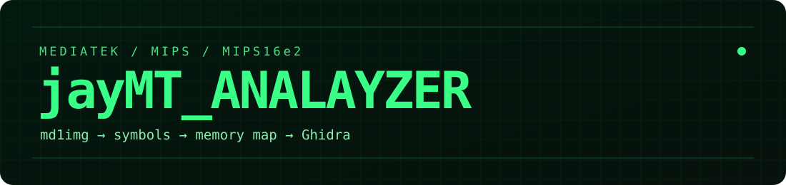

<p align="center"></p>

# jayMT_Analyzer

A compact toolkit for bringing **MediaTek MIPS / MIPS16e2 modem firmware into Ghidra**. Start with `md1img.img`, extract the ROM and symbols, then run a timed headless analysis that reconstructs memory regions and function entry points.

Derived from [FirmWire's Ghidra fork](https://github.com/FirmWire/ghidra), with its MediaTek processor support retained as a small extension. Ghidra is a separate dependency; this repository does not carry the full Ghidra source tree or its history.

## Quick start

Use Python 3.10+, a JDK compatible with your Ghidra release, and an official Ghidra distribution. The initial integration target is **Ghidra 11.4.2 + JDK 21**. Run these commands from this repository:

```sh
export GHIDRA_INSTALL_DIR=/path/to/ghidra_11.4.2_PUBLIC
export JAVA_HOME=/path/to/jdk-21
export PATH="$JAVA_HOME/bin:$PATH"

# Build/install just the processor extension. No full Ghidra build or Gradle.
python3 -m jaymt setup

# Extract and analyze; progress, logs, JSON report, and saved Ghidra project.
python3 -m jaymt analyze /path/to/md1img.img --heap 4G
```

Open the resulting `md1img_jaymt/projects/md1.gpr` in Ghidra. Each run prints its exact project and report paths. Choose `--workspace PATH` and `--project NAME` to control those locations. Existing projects are never overwritten.

To prepare files without starting Ghidra:

```sh
python3 -m jaymt unpack /path/to/md1img.img -o prepared
python3 -m jaymt analyze prepared --workspace analysis
```

Raw md1img requires **only the Python standard library**. Compressed `.lz4` images and CP archives containing LZ4 need the optional dependency:

```sh
python3 -m venv .venv
.venv/bin/python -m pip install -r requirements-lz4.txt
.venv/bin/python -m jaymt unpack firmware.tar.md5 -o prepared
```

`unpack_md1img.py` is the standalone extractor. The old `unpack_mtk_cp_update.py` filename remains a compatibility entry point and now also accepts md1img directly.

## What you get

- `md1rom`: firmware bytes, unchanged.
- `md1_dbginfo.csv`: embedded function symbols, when available.
- `manifest.json`: image hashes, section offsets, load addresses, and build metadata.
- Optional `--all-sections`: also preserve the DSP, raw debug, and other section payloads.
- Analysis logs, stage timings, unresolved-symbol counts, warnings, and a Ghidra project.

## Performance controls

```sh
python3 -m jaymt analyze prepared --threads 16 --heap 8G
```

The default worker count uses the CPUs available to Python. The launcher sets Ghidra's `cpu.core.override` and `-max-cpu`, exposes the Java heap, and lets the JVM choose its GC/JIT worker counts. It does not modify your Ghidra launch scripts. Some analysis tasks and database edits are serial; all-core utilization is not a measure of correctness or a guaranteed speedup.

The analysis removes quadratic symbol-list removal, repeated mode probes, frequent analysis restarts, per-function console spam, and per-word Java calls during pointer scanning. Full analysis remains the default. `--no-bruteforce` explicitly skips the uncertain last MIPS16/MIPS32 guessing stage, trading coverage for time. `--verbose` enables detailed logging.

See [the repository audit](docs/AUDIT.md), [validation results](docs/VALIDATION.md), and [processor support](docs/PROCESSOR.md) for evidence and limits.

## GUI workflow

1. Run `setup`, or install the generated ZIP from `dist/` through Ghidra's extension manager, then restart Ghidra.
2. Import `md1rom` as **Raw Binary**, language **MIPS:LE:32:jaymt**, compiler **default**.
3. Decline initial automatic analysis.
4. Run `analyze_mtk_image.py` from the **jayMT_Analyzer** script category. Select `md1_dbginfo.csv` when asked.

The headless command performs these steps automatically. Its success check requires both a completed script report and a saved project, because Ghidra can otherwise return success even after a script error.

## Scope and accuracy

This preserves the original A41-class **MIPS** workflow. A file named md1img does not identify its CPU: ARM and nanoMIPS firmware need different processor support. Extraction is architecture-neutral; analysis is not. Stripped images can be extracted, but this symbol-driven analysis requires embedded debug symbols.

Memory initialization layouts and uncertain instruction modes are firmware-specific. Some inherited MediaTek DSP instructions have decoding but incomplete p-code semantics. Decompiled C is an analysis aid, not a perfect reconstruction of source. Reports retain warnings and unresolved symbols; broad firmware compatibility and universal speedup are not claimed.

## Development

```sh
python3 -m unittest discover -s tests -v
python3 scripts/build_extension.py --ghidra "$GHIDRA_INSTALL_DIR"
```

The small Python CLI needs no package installation. See [NOTICE](NOTICE) for upstream attribution and [LICENSE](LICENSE) for Apache 2.0 licensing. Firmware images, extracted proprietary binaries, Ghidra distributions, and analysis databases are not included.

## Improvements over the original FirmWire fork

| Area | Original | jayMT_Analyzer |
| --- | --- | --- |
| Repository | Full Ghidra fork; audited checkout ~563 MiB | Compact CLI + processor extension; Ghidra installed separately |
| Firmware input | CP archive required by the CLI | Direct md1img, with optional CP/LZ4 support |
| Extraction | Whole-file copies and repeated debug parsing | Streaming copies, one debug parse, validated offsets and hashes |
| Analysis work | Repeated list searches, mode probes, per-word Java calls | Linear symbol filtering, cached probes, chunked pointer scanning |
| Resources | Legacy launcher: 2 GB heap and fixed GC/JIT limits | Configurable heap and worker count; JVM-managed GC/JIT |
| Compatibility & accuracy | Implicit Python runtime; mapping and symbol-parsing bugs | Explicit Jython runtime, corrected mappings/ISA semantics, regression tests |
| Visibility | Long-running script with noisy per-function output | Green branding, stage progress, elapsed-time updates, JSON results |

Real A41 extraction preserves the ROM and all **99,346 valid symbols**. Full analysis remains the default; no unmeasured speedup multiplier is claimed. [Validation details](docs/VALIDATION.md).
